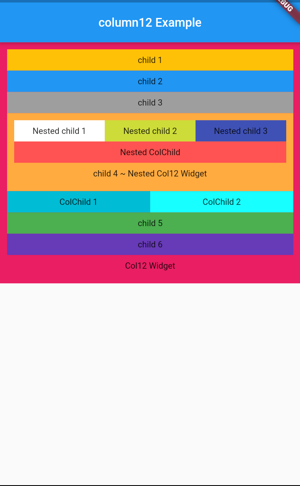
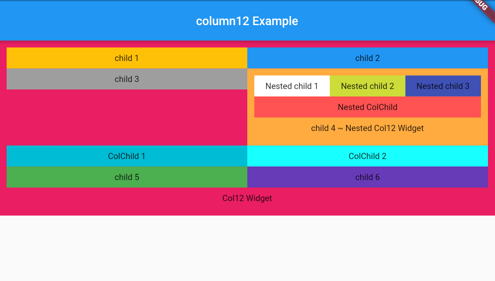

# column12 [Responsive Widget]

Column12 Flutter package helps you to create a responsive widget and Nested responsive widget too. Works on all flutter platform (android, iOs ,**web** ) with both portrait and vertical mode.

## Getting Started

    It works as same as Bootstrap Row Column method, Splitting screen into 12 columns and placing widget by combing column based on screen size.

# Screens

For phones - screens <= 600px wide

For tablets - screens > 600px wide && <= 990 px wide

For laptops - screens > 990px wide

# Widgets

## Col12()

Col12 intakes List\<Widget> & default column size for each widget can be declared.

```dart
    Col12(
        defaultColS : 12, //default column size for Small screen
        defaultColM : 6, //default column size for Medium screen
        defaultColL : 4, //default column size for Large screen
        children:<Widget>[
             Container(
                color: Colors.amber,
                alignment: Alignment.center,
                child: Padding(
                padding: const EdgeInsets.all(8.0),
                child: Text('child 1'),
                ),
            ),
            Container(
                color: Colors.blue,
                alignment: Alignment.center,
                child: Padding(
                padding: const EdgeInsets.all(8.0),
                child: Text('child 2'),
                ),
            ),
        ]
    )    
```

 `defaultColS`, `defaultColM`, `defaultColL` default to  `12` & various from [0-12] 

 0 - 0.0 width (gone)

 12 - full width (provided by parent widget not screen width) 

## ColChild()

To Override the `defaultCol` size use ColChild() as a widget in Col12().

ColChild() intakes child & column sizes.

```dart
     ColChild(
        colS: 10,
        colM: 7,
        colL: 3,
        child: Container(
        alignment: Alignment.center,
        color: Colors.redAccent,
            child: Padding(
                padding: const EdgeInsets.all(8.0),
                child: Text('ColChild'),
            ),
        ),
    )
```

ColChild() works only as direct child of Col12() widget

## Lite Example

```dart
    Col12(
        defaultColS : 12, //defaults to 12
        defaultColM : 6, //defaults to 12
        defaultColL : 4, //defaults to 12
        children:<Widget>[
             Container(
                color: Colors.amber,
                alignment: Alignment.center,
                child: Padding(
                padding: const EdgeInsets.all(8.0),
                child: Text('child 1'),
                ),
            ),
            ColChild(   // as colM not mentioned, it takes the defaulColM size
                colS: 10,  // colS & ColL override the defaultCol size
                colL: 3,
                child: Container(
                alignment: Alignment.center,
                color: Colors.redAccent,
                    child: Padding(
                        padding: const EdgeInsets.all(8.0),
                        child: Text('ColChild'),
                    ),
                ),
            )
            Container(
                color: Colors.blue,
                alignment: Alignment.center,
                child: Padding(
                padding: const EdgeInsets.all(8.0),
                child: Text('child 2'),
                ),
            ),
        ]
    )    

```

## Nesting Col12 

Placing a Col12 widget into a Col12.

The child Col12 widget takes a width provided by Parent Col12 widget and **not the screen width**


## Complete Example





```dart
class FullExample extends StatelessWidget {

  @override
  Widget build(BuildContext context) {
    return Scaffold(
        appBar: AppBar(
          title: Text('column12 Example'),
          centerTitle: true,
        ),
        body: Container(
          color: Colors.pink,
          width: MediaQuery.of(context).size.width,
          padding: EdgeInsets.all(10),
          child: Column(
            mainAxisSize: MainAxisSize.min,
            children: <Widget>[
              Col12(
                  defaultColS: 12,
                  defaultColM: 6,
                  defaultColL: 3,
                  children: <Widget>[
                    Container(
                      color: Colors.amber,
                      alignment: Alignment.center,
                      child: Padding(
                        padding: const EdgeInsets.all(8.0),
                        child: Text('child 1'),
                      ),
                    ),
                    Container(
                      color: Colors.blue,
                      alignment: Alignment.center,
                      child: Padding(
                        padding: const EdgeInsets.all(8.0),
                        child: Text('child 2'),
                      ),
                    ),
                    Container(
                      color: Colors.grey,
                      alignment: Alignment.center,
                      child: Padding(
                        padding: const EdgeInsets.all(8.0),
                        child: Text('child 3'),
                      ),
                    ),
                    Container(
                        padding: EdgeInsets.all(10),
                        color: Colors.orangeAccent,
                        alignment: Alignment.center,
                        child: Column(
                          children: <Widget>[
                            Col12(
                              // nested Col12 widget
                              defaultColS: 4,
                              defaultColM: 4,
                              defaultColL: 4,
                              children: <Widget>[
                                Container(
                                  color: Colors.white,
                                  alignment: Alignment.center,
                                  child: Padding(
                                    padding: const EdgeInsets.all(8.0),
                                    child: Text('Nested child 1'),
                                  ),
                                ),
                                Container(
                                  color: Colors.lime,
                                  alignment: Alignment.center,
                                  child: Padding(
                                    padding: const EdgeInsets.all(8.0),
                                    child: Text('Nested child 2'),
                                  ),
                                ),
                                Container(
                                  color: Colors.indigo,
                                  alignment: Alignment.center,
                                  child: Padding(
                                    padding: const EdgeInsets.all(8.0),
                                    child: Text('Nested child 3'),
                                  ),
                                ),
                                ColChild(
                                  colS: 12,
                                  colM: 12,
                                  colL: 12,
                                  child: Container(
                                    alignment: Alignment.center,
                                    color: Colors.redAccent,
                                    child: Padding(
                                      padding: const EdgeInsets.all(8.0),
                                      child: Text('Nested ColChild'),
                                    ),
                                  ),
                                )
                              ],
                            ),
                            Padding(
                              padding: const EdgeInsets.all(8.0),
                              child: Text('child 4 ~ Nested Col12 Widget'),
                            )
                          ],
                        )),
                    ColChild(
                      colL: 6,
                      colS: 6,
                      colM: 6,
                      child: Container(
                        color: Colors.cyan,
                        alignment: Alignment.center,
                        child: Padding(
                          padding: const EdgeInsets.all(8.0),
                          child: Text('ColChild 1'),
                        ),
                      ),
                    ),
                    ColChild(
                      colL: 6,
                      colS: 6,
                      colM: 6,
                      child: Container(
                        color: Colors.cyanAccent,
                        alignment: Alignment.center,
                        child: Padding(
                          padding: const EdgeInsets.all(8.0),
                          child: Text('ColChild 2'),
                        ),
                      ),
                    ),
                    Container(
                      color: Colors.green,
                      alignment: Alignment.center,
                      child: Padding(
                        padding: const EdgeInsets.all(8.0),
                        child: Text('child 5'),
                      ),
                    ),
                    Container(
                      color: Colors.deepPurple,
                      alignment: Alignment.center,
                      child: Padding(
                        padding: const EdgeInsets.all(8.0),
                        child: Text('child 6'),
                      ),
                    ),
                  ]),
              Padding(
                padding: const EdgeInsets.all(8.0),
                child: Text('Col12 Widget'),
              )
            ],
          ),
        ),
    );
  }
}
```
